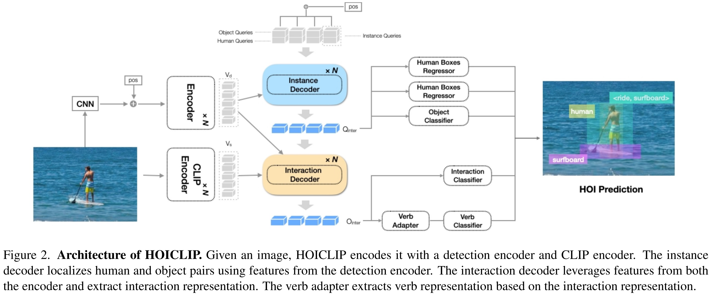

# HOICLIP: Efficient-Knowledge-Transfer-for-HOI-Detection-with-Visual-Linguistic-Model

Code for our CVPR 2023
paper "[HOICLIP: Efficient-Knowledge-Transfer-for-HOI-Detection-with-Visual-Linguistic-Model](https://arxiv.org/abs/2303.15786)"
.

Contributed by Shan Ning*, Longtian Qiu*, Yongfei Liu, Xuming He.



## Installation

Install the dependencies.

```
pip install -r requirements.txt
```

## Data preparation

### HICO-DET

HICO-DET dataset can be downloaded [here](https://drive.google.com/open?id=1QZcJmGVlF9f4h-XLWe9Gkmnmj2z1gSnk). After
finishing downloading, unpack the tarball (`hico_20160224_det.tar.gz`) to the `data` directory.

Instead of using the original annotations files, we use the annotation files provided by the PPDM authors. The
annotation files can be downloaded from [here](https://drive.google.com/open?id=1dUByzVzM6z1Oq4gENa1-t0FLhr0UtDaS). The
downloaded annotation files have to be placed as follows.
For fractional data setting, we provide the
annotations [here](https://drive.google.com/file/d/13O_uUv_17-Db9ghDqo4z2s3MZlfZJtgi/view?usp=sharing). After
decompress, the files should be placed under `data/hico_20160224_det/annotations`.

```
data
 └─ hico_20160224_det
     |─ annotations
     |   |─ trainval_hico.json
     |   |─ test_hico.json
     |   |─ corre_hico.json
     |   |─ trainval_hico_5%.json
     |   |─ trainval_hico_15%.json
     |   |─ trainval_hico_25%.json
     |   └─ trainval_hico_50%.json
     :
```

### V-COCO

First clone the repository of V-COCO from [here](https://github.com/s-gupta/v-coco), and then follow the instruction to
generate the file `instances_vcoco_all_2014.json`. Next, download the prior file `prior.pickle`
from [here](https://drive.google.com/drive/folders/10uuzvMUCVVv95-xAZg5KS94QXm7QXZW4). Place the files and make
directories as follows.

```
GEN-VLKT
 |─ data
 │   └─ v-coco
 |       |─ data
 |       |   |─ instances_vcoco_all_2014.json
 |       |   :
 |       |─ prior.pickle
 |       |─ images
 |       |   |─ train2014
 |       |   |   |─ COCO_train2014_000000000009.jpg
 |       |   |   :
 |       |   └─ val2014
 |       |       |─ COCO_val2014_000000000042.jpg
 |       |       :
 |       |─ annotations
 :       :
```

For our implementation, the annotation file have to be converted to the HOIA format. The conversion can be conducted as
follows.

```
PYTHONPATH=data/v-coco \
        python convert_vcoco_annotations.py \
        --load_path data/v-coco/data \
        --prior_path data/v-coco/prior.pickle \
        --save_path data/v-coco/annotations
```

Note that only Python2 can be used for this conversion because `vsrl_utils.py` in the v-coco repository shows a error
with Python3.

V-COCO annotations with the HOIA format, `corre_vcoco.npy`, `test_vcoco.json`, and `trainval_vcoco.json` will be
generated to `annotations` directory.

## Pre-trained model

Download the pretrained model of DETR detector for [ResNet50](https://dl.fbaipublicfiles.com/detr/detr-r50-e632da11.pth)
, and put it to the `params` directory.

```
python ./tools/convert_parameters.py \
        --load_path params/detr-r50-e632da11.pth \
        --save_path params/detr-r50-pre-2branch-hico.pth \
        --num_queries 64

python ./tools/convert_parameters.py \
        --load_path params/detr-r50-e632da11.pth \
        --save_path params/detr-r50-pre-2branch-vcoco.pth \
        --dataset vcoco \
        --num_queries 64
```

## Training

After the preparation, you can start training with the following commands.

### HICO-DET

```
# default setting
sh ./scripts/train_hico.sh
```

### V-COCO

```
sh ./scripts/train_vcoco.sh
```

### Zero-shot

```
# rare first unseen combination setting
sh ./scripts/train_hico_rf_uc.sh
# non rare first unseen combination setting
sh ./scripts/train_hico_nrf_uc.sh
# unseen object setting
sh ./scripts/train_hico_uo.sh
# unseen verb setting
sh ./scripts/train_hico_uv.sh
```

### Fractional data

```
# 50% fractional data
sh ./scripts/train_hico_frac.sh
```

### Generate verb representation for Visual Semantic Arithmetic

```
sh ./scripts/generate_verb.sh
```

We provide the generated verb representation in `./tmp/verb.pth` for hico and `./tmp/vcoco_verb.pth` for vcoco.

## Evaluation

### HICO-DET

You can conduct the evaluation with trained parameters for HICO-DET as follows.

```
python -m torch.distributed.launch \
        --nproc_per_node=2 \
        --use_env \
        main.py \
        --pretrained [path to your checkpoint] \
        --dataset_file hico \
        --hoi_path data/hico_20160224_det \
        --num_obj_classes 80 \
        --num_verb_classes 117 \
        --backbone resnet50 \
        --num_queries 64 \
        --dec_layers 3 \
        --eval \
        --zero_shot_type default \
        --with_clip_label \
        --with_obj_clip_label \
        --use_nms_filter
```

For the official evaluation (reported in paper), you need to covert the prediction file to an official prediction format
following [this file](./tools/covert_annot_for_official_eval.py), and then
follow [PPDM](https://github.com/YueLiao/PPDM) evaluation steps.

[//]: # (### V-COCO)

[//]: # ()
[//]: # (Firstly, you need the add the following main function to the vsrl_eval.py in data/v-coco.)

[//]: # ()
[//]: # (```)

[//]: # (if __name__ == '__main__':)

[//]: # (  import sys)

[//]: # ()
[//]: # (  vsrl_annot_file = 'data/vcoco/vcoco_test.json')

[//]: # (  coco_file = 'data/instances_vcoco_all_2014.json')

[//]: # (  split_file = 'data/splits/vcoco_test.ids')

[//]: # ()
[//]: # (  vcocoeval = VCOCOeval&#40;vsrl_annot_file, coco_file, split_file&#41;)

[//]: # ()
[//]: # (  det_file = sys.argv[1])

[//]: # (  vcocoeval._do_eval&#40;det_file, ovr_thresh=0.5&#41;)

[//]: # (```)

[//]: # ()
[//]: # (Next, for the official evaluation of V-COCO, a pickle file of detection results have to be generated. You can generate)

[//]: # (the file with the following command. and then evaluate it as follows.)

[//]: # ()
[//]: # (```)

[//]: # (python generate_vcoco_official.py \)

[//]: # (        --param_path pretrained/VCOCO_GEN_VLKT_S.pth \)

[//]: # (        --save_path vcoco.pickle \)

[//]: # (        --hoi_path data/v-coco \)

[//]: # (        --num_queries 64 \)

[//]: # (        --dec_layers 3 \)

[//]: # (        --use_nms_filter \)

[//]: # (        --with_clip_label \)

[//]: # (        --with_obj_clip_label)

[//]: # ()
[//]: # (cd data/v-coco)

[//]: # (python vsrl_eval.py vcoco.pickle)

[//]: # ()
[//]: # (```)

### Zero-shot

```
python -m torch.distributed.launch \
        --nproc_per_node=8 \
        --use_env \
        main.py \
        --pretrained [path to your checkpoint] \
        --dataset_file hico \
        --hoi_path data/hico_20160224_det \
        --num_obj_classes 80 \
        --num_verb_classes 117 \
        --backbone resnet50 \
        --num_queries 64 \
        --dec_layers 3 \
        --eval \
        --with_clip_label \
        --with_obj_clip_label \
        --use_nms_filter \
        --zero_shot_type rare_first \
        --del_unseen
```

### Training Free Enhancement
The `Training Free Enhancement` is used when args.training_free_enhancement_path is not empty.
The results are placed in args.output_dir/args.training_free_enhancement_path.
You may refer to codes in `engine.py:202`.
By default, we set the topk to [10, 20, 30, 40, 50].

## Visualization

Script for visualization is in `scripts/visualization_hico.sh`
You may need to adjust the file paths with TODO comment in `visualization_hoiclip/gen_vlkt.py` and currently the code
visualize fail cases in some zero-shot setting. For detail information, you may refer to the comments.

## Regular HOI Detection Results

### HICO-DET

|         | Full (D) |Rare (D)|Non-rare (D)|Full(KO)|Rare (KO)|Non-rare (KO)|Download|              Conifg               |
|:--------|:--------:| :---: | :---: | :---: |:-------:|:-----------:| :---: |:---------------------------------:|
| HOICLIP |  34.69   | 31.12 |35.74 | 37.61|  34.47  |    38.54    | [model](https://drive.google.com/file/d/1q3JuEzICoppij3Wce9QfwZ1k9a4HZ9or/view?usp=drive_link) | [config](./scripts/train_hico.sh) |

D: Default, KO: Known object. The best result is achieved with training free enhancement (topk=10).

### HICO-DET Fractional Setting

| | Fractional |Full| Rare | Non-rare  |                     Config                     | 
| :--- |:----------:| :---: |:----:|:---------:|:----------------------------------------------:|
| HOICLIP|     5%     |22.64 |21.94 |   24.28   |     [config](./scripts/train_hico_frac.sh)     |
| HOICLIP|    15%     |27.07 |   24.59   |   29.38   |     [config](./scripts/train_hico_frac.sh)     |
| HOICLIP|    25%     |28.44 |25.47|   30.52   |     [config](./scripts/train_hico_frac.sh)     |
| HOICLIP|    50%     |30.88|26.05 |   32.97   |     [config](./scripts/train_hico_frac.sh)     |

You may need to change the `--frac [portion]%` in the scripts.

### V-COCO

| | Scenario 1 | Scenario 2 | Download |               Config               | 
| :--- | :---: | :---: | :---: |:----------------------------------:|
|HOICLIP| 63.50| 64.81 | [model](https://drive.google.com/file/d/1PAT2P3TaBCwG3AHuFcbe3iOk2__XOf_R/view?usp=drive_link) | [config](./scripts/train_vcoco.sh) |

## Zero-shot HOI Detection Results

| |Type |Unseen| Seen| Full|Download|                   Conifg                   |
| :--- | :---: | :---: | :---: | :---: | :---: |:------------------------------------------:|
| HOICLIP|RF-UC |25.53 |34.85 |32.99| [model](https://drive.google.com/file/d/1E7QLhKgsC1qutGUinXIPmANRR3glYQ1h/view?usp=sharing)|  [config](./scripts/train_hico_rf_uc.sh)   |
| HOICLIP|NF-UC |26.39| 28.10| 27.75| [model](https://drive.google.com/file/d/1W1zUEX3uDJN32UMI8seTDzmXZ5i9uBz7/view?usp=drive_link)|  [config](./scripts/train_hico_nrf_uc.sh)  |
| HOICLIP|UO |16.20| 30.99| 28.53| [model](https://drive.google.com/file/d/1oOe8rOwGDugIhd5N3-dlwyf5SpxYFkHE/view?usp=drive_link)|    [config](./scripts/train_hico_uo.sh)    |
| HOICLIP|UV|24.30| 32.19| 31.09| [model](https://drive.google.com/file/d/174J4x0LovEZBnZ_0yAObMsdl5sW9SZ84/view?usp=drive_link)|    [config](./scripts/train_hico_uv.sh)    |

We also provide the checkpoints for uc0, uc1, uc2, uc3 settings in [Google Drive](https://drive.google.com/drive/folders/1NddLSPHbNZXlxmIQbcobh2O5KKWAITRo?usp=drive_link)
## Citation

Please consider citing our paper if it helps your research.

```
@inproceedings{ning2023hoiclip,
  title={HOICLIP: Efficient Knowledge Transfer for HOI Detection with Vision-Language Models},
  author={Ning, Shan and Qiu, Longtian and Liu, Yongfei and He, Xuming},
  booktitle={Proceedings of the IEEE/CVF Conference on Computer Vision and Pattern Recognition},
  pages={23507--23517},
  year={2023}
}
```

## Acknowledge

Codes are built from [GEN-VLKT](https://github.com/YueLiao/gen-vlkt), [PPDM](https://github.com/YueLiao/PPDM)
, [DETR](https://github.com/facebookresearch/detr), [QPIC](https://github.com/hitachi-rd-cv/qpic)
and [CDN](https://github.com/YueLiao/CDN). We thank them for their contributions.

# Release Schedule

- [x] Update raw codes(2023/4/14)
- [x] Update readme(2023/7/26)
    - [x] Data(2023/7/26)
    - [x] Scripts(2023/7/26)
    - [x] Performance table(2023/7/26)
    - [x] Others(2023/7/26)
- [x] Release trained checkpoints(2023/7/26)
    - [x] Default settings(2023/7/26)
    - [x] Zero-shot settings(2023/7/26)
    - [x] Fractional settings(2023/7/26)
- [x] Clean up codes(2023/7/26)
